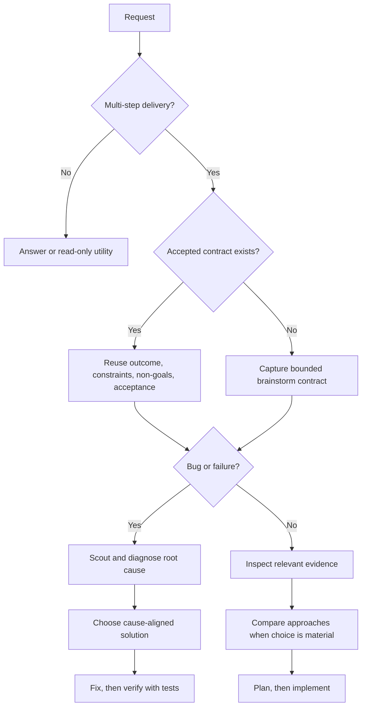

# Brainstorm

Turn incomplete intent into a bounded delivery contract. Stay honest about
evidence, trade-offs, and uncertainty without turning a clear request into a
ceremonial interview.

## Brainstorm contract

Every multi-step product, code, documentation, or maintainer delivery starts by
capturing:

- **Outcome:** the user-visible or operational end state.
- **Constraints:** safety, compatibility, time, technology, and ownership
  boundaries that shape the work.
- **Non-goals:** nearby work that this delivery will not absorb.
- **Acceptance criteria:** observable evidence that will prove completion.

An accepted design or plan satisfies the opening gate when it already contains
these fields. Reuse it and identify only material gaps; do not make the user
repeat settled decisions.

## Proportional behavior

- For a concrete request, summarize the four fields briefly and continue.
- Ask a concise question only when a missing answer would materially change the
  result, safety boundary, or public contract and cannot be discovered. When
  the problem is still too fuzzy for four fields, suggest the `grill-me` skill
  to settle it a round of questions at a time.
- Explicit autonomous execution may continue once the four fields are concrete;
  it does not require a routine approval pause.
- Direct answers and low-level read-only utilities do not require a design loop.
  If investigation turns into workspace mutation or delivery, satisfy the gate
  before that boundary.
- Separate target intent from current evidence. Inspect relevant repository or
  live state before claiming an approach is feasible.
- Separate uncertainty that can be discovered from uncertainty that cannot. Most
  unknowns are resolvable by reading source, docs, tests, or live state — resolve
  those instead of hedging against them. Reserve robustness reasoning for what
  stays unknowable at decision time, such as future requirements, third-party
  behavior, or audience response.

## Bug routing

For bugs, start by framing the expected repaired behavior, constraints,
non-goals, and acceptance evidence. Do not propose fixes from the symptom.

1. Scout the affected path and capture the failing state.
2. Diagnose and prove the root cause with the `debug` skill.
3. Compare cause-aligned solutions only after diagnosis.
4. Use a full options discussion when multiple viable fixes or an architecture
   decision remain; otherwise record why the direct fix is sufficient.

This preserves brainstorm-first intent without allowing brainstorming to replace
root-cause analysis.

## Option exploration

When the work has a real design choice:

1. Inspect the smallest relevant source, docs, tests, and current plans.
2. State the confirmed constraints and any evidence gaps.
3. Present up to three viable approaches with meaningful trade-offs. For each,
   name the assumption it depends on most and the condition under which it fails
   first. Compare approaches on their worst plausible case, not only their best.
4. Recommend the smallest approach that satisfies the contract. When a
   load-bearing assumption cannot be resolved now, prefer the approach that is
   cheapest to abandon.
5. Resolve material disagreement before implementation begins.

Challenge assumptions with evidence. Apply KISS and DRY. Deliver the full
requested scope — never trim or defer what the user explicitly asked for. Do not
invent extra components, migrations, or governance to make a design look
complete. With `--yagni`, additionally challenge and cut any scope not needed for
the stated outcome.

When the options stall — every approach looks forced, or the special cases keep
growing — apply the `problem-solving` skill to reframe the problem. When the
chosen direction is high-risk, run `predict` on it before handoff.

## Authoritative flow

The opening contract is always first for delivery. Detailed solution exploration
may occur later when diagnosis or inspection provides the evidence it needs.

## Handoff

Pass the four contract fields, chosen direction, evidence, and unresolved risks
to the next owning step:

- feature or documentation delivery: the project's planning step, then
  implementation;
- test strategy: `scenario` for test cases, then `web-testing` or `test create`
  to build the suite;
- diagnosed bug: the fix, then `test` to prove it;
- exploration only: report the recommendation and stop.

If the user passed `--yagni`, include the literal flag in every downstream skill
or subagent handoff. Otherwise, do not introduce it during handoff.

Write a durable summary only when the decision must survive the session or feed
a plan. Use the repository's configured report location and naming convention;
do not create a report merely to satisfy the gate.

## HTML Output Mode (`--html`)

When `--html` is present, capture the accepted brainstorm outcome as a
self-contained HTML brief the user can preview before delivery starts. The brief
augments the handoff; it never replaces the four contract fields passed to the
next workflow.

- Write `brainstorm.html` in the report location described under `--report`.
  Self-contained: inline CSS and JavaScript, no build step, no network-required
  assets, safe to open directly from disk. Keep it accessible, responsive, and
  reduced-motion friendly.
- Include the four contract fields, the compared approaches with trade-offs, the
  recommendation and its rationale, and any unresolved risks or questions.
- **Implementation workflow diagram (required):** render at least one inline
  diagram (semantic SVG with `<title>` and `<desc>`, or HTML/CSS) that
  visualizes what the chosen direction will build and how its steps or
  components connect — the delivery flow, not only the decision tree.
- **UI/UX mockups with annotations (required when the topic touches UI/UX):**
  embed annotated mockups of the proposed interface directly in the HTML so the
  user previews intended UI before planning. Derive layout, color, type,
  spacing, and component states from the project design guidelines
  (`docs/design-guidelines.md` when present, otherwise a restrained editorial
  style). Add callouts tying each element to design tokens, interaction states,
  and the acceptance evidence it satisfies.
- For approach comparisons, prefer a labeled quadrant or scored comparison over
  a plain table when it makes the trade-off easier to read. When a frontend
  design skill is installed, use it for layout and design critique.

## Report Output Mode (`--report`)

When `--report` is present, persist the accepted brainstorm as a durable
markdown report:

- **Path:** the active plan's `reports/` folder when a plan exists, otherwise
  the project's existing reports folder (for example `plans/reports/`), otherwise
  `qa-reports/` at the repository root.
- **Naming:** timestamped kebab-case, `brainstorm-{YYMMDD-HHmm}-{slug}.md`.
- **Body:** frontmatter, summary, the four contract fields, options considered
  with trade-offs, recommendation, and unresolved questions last.

`--report` composes with every other flag: with `--html` both artifacts are
written; with `--ultra` the report records the winning candidate plus the short
ranking appendix. Without `--report`, keep the existing behavior — write a
durable summary only when the decision must survive the session or feed a plan.

## Advisory supervision (`--advice`)

When `--advice` is present, run this skill under an advisory supervisor: one
read-only subagent on the strongest model the runtime offers (in Claude Code,
the top model tier; in Codex, the strongest model at high reasoning effort). The
supervisor returns counsel only — never code, never file edits, never gate
overrides. The main agent stays responsible for every decision and edit. If the
runtime cannot pin a stronger model, say in one sentence that the advice is
same-model counsel; if it cannot spawn subagents at all, say so and continue
without `--advice`.

Consult the supervisor at these checkpoints, passing redacted context (no
secrets, credentials, or personal data):

- **After each phase, step, or decision round completes** — pass the goal, what
  changed or was concluded, and the evidence; ask for a go/no-go and the next
  risk to watch before continuing.
- **When stuck** — repeated failures, a blocked step, or contradictory evidence;
  pass everything already tried and the exact obstacle.
- **Before a high-stakes decision** — a design fork, a public-contract or
  security-sensitive change, or an irreversible action; get counsel first.

Pass `--advice` to downstream qa-kit skills that support it (`test create`,
`test optimize`, `test audit`) so supervision persists across the handoff.
Empty counsel is a non-fatal miss; `--advice` never bypasses approval gates,
tests, or review blockers.

## Ultra Verifier Mode (`--ultra`)

When `--ultra` is present, run the brainstorm as a best-of-5 verifier pass
instead of a single draft. The controller builds one immutable evidence packet
plus a rubric, dispatches exactly five independent read-only candidate
brainstorms in one parallel wave, then a single strongest-model verifier scores
and ranks them and selects the winning candidate (or rejects all).

- **Candidate task:** each candidate produces a complete bounded contract —
  outcome, constraints, non-goals, acceptance criteria — plus its recommended
  direction and trade-offs.
- **Rubric:** faithfulness to the request, evidence grounding, sharpness of the
  acceptance criteria, and honesty about unknowns.
- **Finalizer:** the verifier selects the single winning contract; the
  controller emits that winner unchanged (it does not blend candidates) and
  records a short ranking appendix. On reject-all, hard-stop and report why.

Full mechanics — evidence packet, anonymization, the five-usable-candidate gate
with one bounded re-dispatch, the fail-closed runtime rule, and reject-all — are
in `references/ultra-verifier-mode.md`. `--ultra` composes with `--html`,
`--report`, `--advice`, and `--yagni`, and adds no new conflicts. It is a best-of-5 verifier
mode inspired by LLM-as-a-Verifier, not the full framework; never claim its
logprob/tournament algorithm.

## Boundaries

- This skill shapes intent and choices; it does not implement the solution.
- Never claim current behavior from intent alone.
- Never expose secrets or unrelated private files during inspection.
- List unresolved questions last when any remain.

## Workflow position

**Typically follows:** `grill-me` when the problem started fuzzy.

**Typically precedes:** planning and implementation, `predict` for high-risk
directions, or `scenario` when the outcome is a test strategy.

**Bug path:** opening intent frame -> scout and `debug` -> solution brainstorm
when needed -> fix -> `test`.
